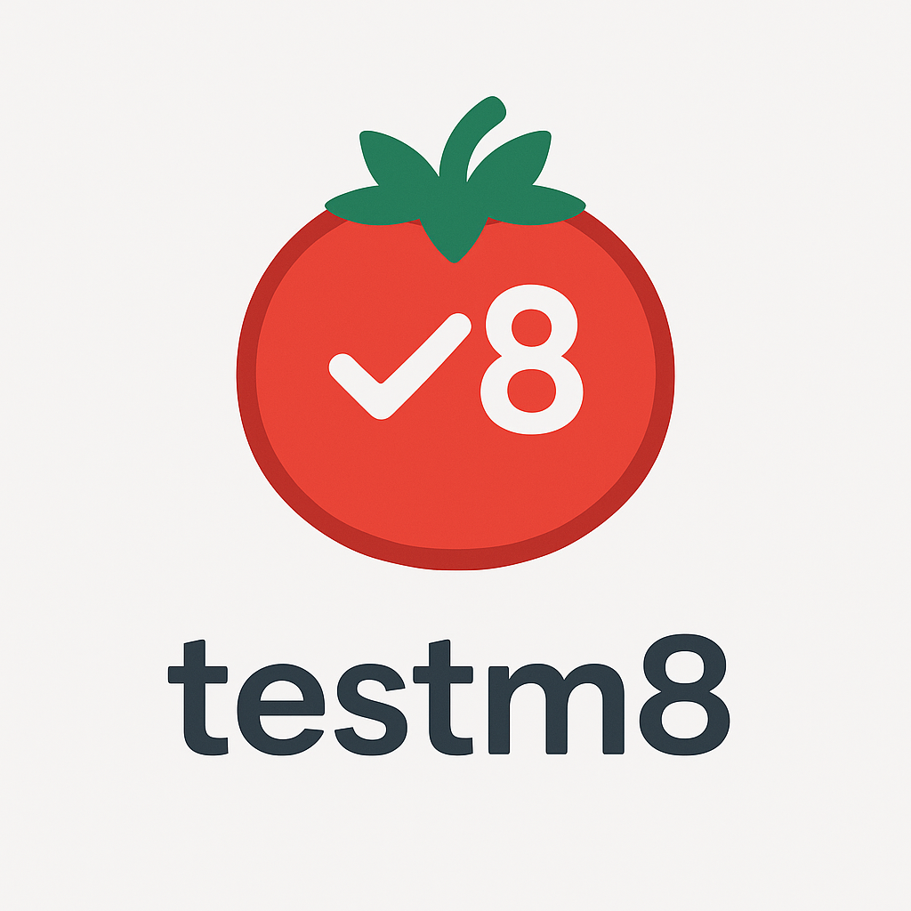

# 🧪 Testm8 - 実行ガイド



このドキュメントでは、Testm8拡張機能を実行するための詳細な手順を説明します。

## 📋 前提条件

### 必要なソフトウェア
- **Node.js** (v16.0.0以上)
- **npm** (Node.jsと一緒にインストール)
- **Cursor** または **VS Code**

### 環境構築の確認
```bash
# プロジェクトディレクトリに移動
cd /home/warapi/Projects/Testm8

# 依存関係のインストール
npm install

# TypeScriptのコンパイル
npm run compile
```

## 🚀 実行手順

### ステップ1: Cursorでプロジェクトを開く

```bash
# プロジェクトディレクトリでCursorを起動
cursor . --new-window
```

**重要**: `--new-window`オプションを使用して新しいウィンドウで開くことを推奨します。

### ステップ2: デバッグ実行の開始

Cursorが開いたら：

1. **F5キー**を押す
2. または **Ctrl+Shift+P** → "Debug: Start Debugging" を選択
3. **"Run Extension"** を選択

### ステップ3: 新しいCursorウィンドウの確認

- 新しいCursorウィンドウが自動で起動します
- このウィンドウには拡張機能が読み込まれています
- ウィンドウのタイトルに `[Extension Development Host]` が表示されます

### ステップ4: 拡張機能の実行

新しいウィンドウで：

1. **Ctrl+Shift+P** を押してコマンドパレットを開く
2. **"Open Testm8"** と入力
3. 表示されるコマンドを選択

### ステップ5: UIの確認

拡張機能が正常に実行されると、以下のUIが表示されます：

- 🧪 **ヘッダー**: "Testm8" タイトル
- 📊 **統計情報**: "16 testcases, 48 tags"
- 🔍 **検索ボックス**: "Search testcases by title..."
- 📋 **テーブル**: 美しいコードブロックとタグバッジ

## 🐛 トラブルシューティング

### 問題1: "could not find ~ npm.compile" エラー

**原因**: タスク設定の問題

**解決方法**:
1. `.vscode/launch.json`と`.vscode/tasks.json`が正しく設定されていることを確認
2. 必要に応じて手動でコンパイル：
   ```bash
   npm run compile
   ```

### 問題2: "No testcases found" エラー

**原因**: ファイル検索パスの問題

**解決方法**:
1. デバッグコンソール（Ctrl+Shift+Y）でログを確認
2. 以下のログが表示されることを確認：
   ```
   Workspace root: /home/warapi/Projects/Testm8
   Found files: ["/home/warapi/Projects/Testm8/testcases/example.yml", "/home/warapi/Projects/Testm8/testcases/advanced.yml"]
   ```

### 問題3: ホームディレクトリ（~）で起動する

**原因**: ワークスペース設定の問題

**解決方法**:
1. 正しいプロジェクトディレクトリでCursorを開く
2. `--new-window`オプションを使用
3. launch.jsonに`"cwd": "${workspaceFolder}"`が設定されていることを確認

### 問題4: 拡張機能が見つからない

**原因**: コンパイルエラーまたは設定の問題

**解決方法**:
1. TypeScriptのコンパイルを確認：
   ```bash
   npm run compile
   ```
2. `dist/extension.js`が存在することを確認
3. デバッグコンソールでエラーメッセージを確認

## 🔧 デバッグ情報の確認

### デバッグコンソールの開き方
1. **Ctrl+Shift+Y** を押す
2. または **View** → **Debug Console**

### 確認すべきログ
```
Workspace root: /home/warapi/Projects/Testm8
Found files: ["/home/warapi/Projects/Testm8/testcases/example.yml", "/home/warapi/Projects/Testm8/testcases/advanced.yml"]
```

## 📁 プロジェクト構造の確認

実行前に以下のファイルが存在することを確認：

```
Testm8/
├── src/extension.ts          # メインの拡張機能コード
├── dist/extension.js         # コンパイル済みファイル
├── testcases/
│   ├── example.yml          # 8つの基本テストケース
│   └── advanced.yml         # 8つの高度なテストケース
├── .vscode/
│   ├── launch.json          # デバッグ設定
│   └── tasks.json           # タスク設定
└── package.json             # プロジェクト設定
```

## 🎯 UI機能の使用方法

### 検索機能
- 検索ボックスに文字を入力
- タイトル、入力、期待値、タグすべてで検索可能
- リアルタイムで統計情報が更新

### ソート機能
- 各列のヘッダーをクリック
- ↑↓ アイコンでソート方向を確認
- 複数列でのソートが可能

### レスポンシブデザイン
- ウィンドウサイズを変更して確認
- モバイル対応のレイアウト

## 📊 表示されるテストケース

### example.yml (8個)
1. **Basic Math Addition** - 基本的な数学演算
2. **String Uppercase** - 文字列の大文字変換
3. **Array Filter** - 配列のフィルタリング
4. **Object Property Access** - オブジェクトプロパティアクセス
5. **Async Function** - 非同期関数
6. **Regular Expression** - 正規表現
7. **Date Formatting** - 日付フォーマット
8. **Error Handling** - エラーハンドリング

### advanced.yml (8個)
1. **Complex Object Destructuring** - 複雑なオブジェクト分割代入
2. **Promise Chain** - Promiseチェーン
3. **Generator Function** - ジェネレーター関数
4. **Class Definition** - クラス定義
5. **Map Data Structure** - Mapデータ構造
6. **Set Operations** - Set操作
7. **Template Literals** - テンプレートリテラル
8. **Arrow Function with Default Parameters** - デフォルトパラメータ付きアロー関数

## 🔄 再実行手順

コードを変更した場合：

1. **TypeScriptを再コンパイル**:
   ```bash
   npm run compile
   ```

2. **拡張機能を再読み込み**:
   - デバッグウィンドウで **Ctrl+R** を押す
   - または拡張機能ウィンドウを閉じて再実行

3. **新しいテストケースの追加**:
   - `testcases/`ディレクトリに新しいYAMLファイルを作成
   - 以下の形式で記述：
   ```yaml
   - title: 新しいテストケース
     input: テスト入力
     expected: 期待される出力
     tags: [タグ1, タグ2]
   ```

## ✅ 成功の確認

正常に実行されると以下が表示されます：

- ✅ 16個のテストケース
- ✅ 美しいUI（コードブロック、タグバッジ）
- ✅ 検索・ソート機能
- ✅ リアルタイム統計更新
- ✅ レスポンシブデザイン

## 📚 参考リンク

- [SETUP.md](./SETUP.md) - 環境構築ガイド
- [README.md](./README.md) - プロジェクト概要
- [VS Code Extension API](https://code.visualstudio.com/api) - 拡張機能開発ドキュメント

---

**作成日**: 2024年12月
**バージョン**: 1.0.0 