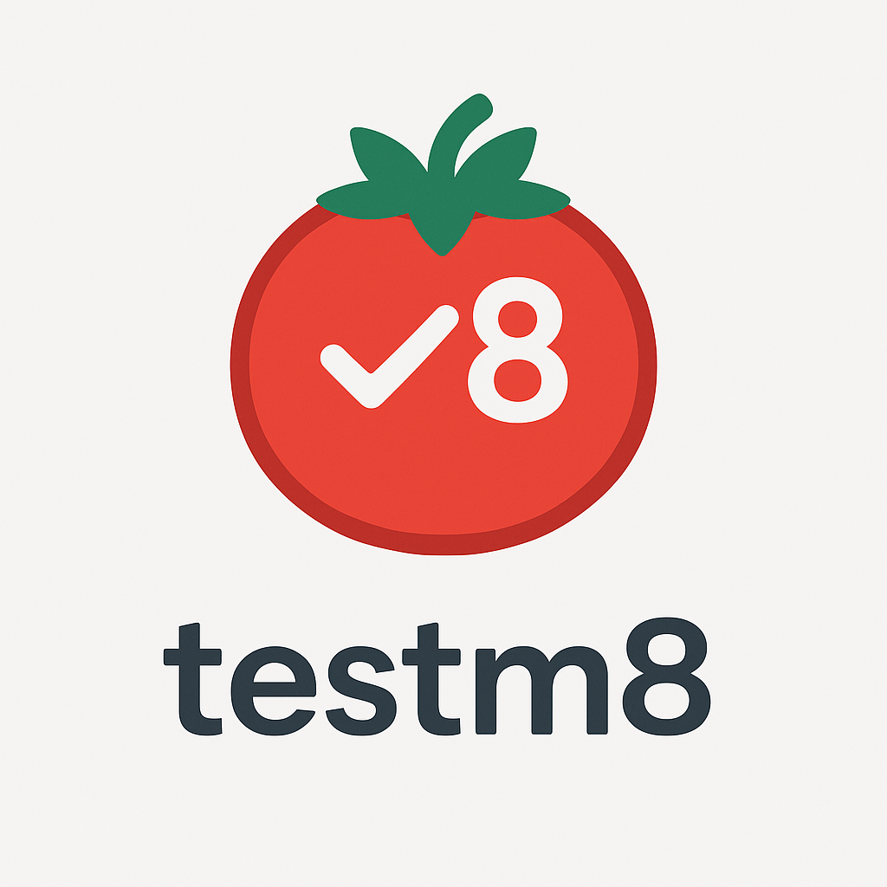

# 🧪 Testm8



Testm8 は、ワークスペース内の `testcases/*.yml` を読み込み、テストケースを一覧表示する VS Code / Cursor 用の拡張機能です。タイトルや入出力、タグ情報をテーブル表示し、クリックでソートやフィルタリングができます。

## 特徴
- YAML 形式のテストケースを自動で読み込み
- クリックでテーブルのソートが可能
- タイトルでのフィルタリング機能
- 拡張機能コマンド `Open Testm8` で WebView を表示

## セットアップ

### クイックセットアップ（推奨）
```bash
# 自動セットアップスクリプトを実行
./setup.sh
```

### 手動セットアップ
1. リポジトリをクローンし、依存関係をインストールします。
   ```bash
   npm install
   ```
2. TypeScript をコンパイルして `dist` ディレクトリを生成します。
   ```bash
   npm run compile
   ```

**詳細な環境構築手順は [SETUP.md](./SETUP.md) を参照してください。**

**実行手順は [EXECUTION_GUIDE.md](./EXECUTION_GUIDE.md) を参照してください。**

## Cursor での実行手順
1. Cursor でこのフォルダを開きます。
2. `npm install` と `npm run compile` を実行します（上記参照）。
3. `F5` または `Debug: Start Debugging` を実行し、`Run Extension` 構成を選択すると、拡張機能が読み込まれた別ウィンドウが起動します。
4. コマンドパレット (`Ctrl+Shift+P`) から `Open Testm8` を実行すると、テストケース一覧が表示されます。

## テストケースの書き方
`testcases` フォルダ内に YAML ファイルを作成します。複数のテストケースを配列として記述できます。
```yaml
- title: Sample Test
  input: 1 + 1
  expected: 2
  tags: [math, sample]
- title: Another Test
  input: 'hello'.toUpperCase()
  expected: 'HELLO'
  tags: [string]
```

Markdown + Frontmatter 形式も利用できます。1ファイルに1ケースを記述し、`key` や `type` などのメタ情報を含めます。
```md
---
key: C-SAMPLE-0001
title: "サンプルケース / Sample case"
type: E2E
priority: P1
status: ready
tags: [sample]
---
本文は任意です。
```

## 📁 プロジェクト構造

```
Testm8/
├── src/                    # ソースコード
│   └── extension.ts       # メインの拡張機能コード
├── resources/              # リソースファイル
│   └── Testm8.png        # メインアイコン
├── testcases/             # テストケースファイル
│   ├── example.yml       # 基本テストケース
│   ├── advanced.yml      # 高度なテストケース
│   └── C-AUTH-0123-login-invalid.md  # Frontmatter形式のサンプル
├── scripts/               # ユーティリティスクリプト
│   └── prepare-icons.sh  # アイコン準備スクリプト
├── dist/                  # コンパイル済みファイル
├── .vscode/              # VS Code設定
└── package.json          # プロジェクト設定
```

## 開発メモ
- 主要なソースコードは `src/extension.ts` にあります。
- コンパイル済みファイルは `.gitignore` によりコミット対象外です。
- リソースファイルは `resources/` ディレクトリに配置されています。

## 🎨 アイコン

このプロジェクトでは、美しいアイコンを使用しています：

- **メインアイコン**: `resources/Testm8.png` - 拡張機能のメインアイコン
- **アイコン準備**: `npm run prepare-icons` - 適切なサイズにリサイズ

### アイコンサイズ
- **128x128px**: `resources/icon-128.png` - VS Code拡張機能用
- **256x256px**: `resources/icon-256.png` - 高解像度ディスプレイ用
- **512x512px**: `resources/icon-512.png` - プレビュー用

## ライセンス
MIT License

